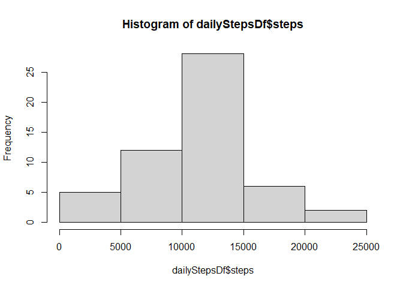
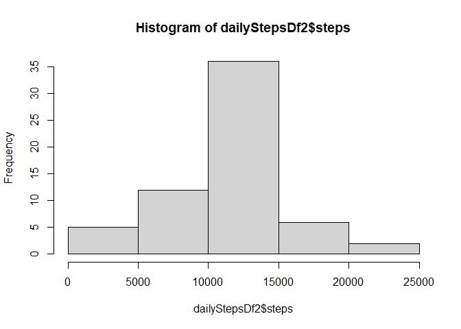

## Loading and preprocessing the data
1. Load the data
  
  ```r
     stepsDf <- read.csv("activity.csv")
  ```

2. Aggregate the steps for each day (To be used later)
  
  ```r
        dailyStepsDf<-aggregate(steps~date,data=stepsDf,sum,na.rm=TRUE)
  ```
3. Aggregate steps for each five minute time interval averaged across the days in the study (To be used later)
  
  ```r
    stepsDailyAgg5minIntDf<-aggregate(steps~interval,data=stepsDf,mean,na.rm=TRUE)
  ```

## What is mean total number of steps taken per day?

1. Create a Hist for the number of steps taken each day

  
  ```r
    hist(dailyStepsDf$steps)
  ```
  
  <!-- -->

2. Calculate and report the **mean** and **median** total number of steps taken 
per day 

  
  ```r
     mean(dailyStepsDf$steps)
  ```
  
  ```
  ## [1] 10766.19
  ```
  
  ```r
     median(dailyStepsDf$steps)
  ```
  
  ```
  ## [1] 10765
  ```

## What is the average daily activity pattern?

1. Make a time series plot (i.e. type = "l") of the 5-minute interval (x-axis) and the average number of steps taken, averaged across all days (y-axis)
  
  ```r
    plot(steps~interval,data=stepsDailyAgg5minIntDf,type="l")
  ```
  
  <!-- -->
2. Which 5-minute interval, on average across all the days in the data set, contains the maximum number of steps? 
  
  ```r
    stepsDailyAgg5minIntDf[which.max(stepsDailyAgg5minIntDf$steps),]$interval
  ```
  
  ```
  ## [1] 835
  ```
  
## Imputing missing values

1. Calculate and report the total number of missing values in the data set (i.e. the total number of rows with NAs)
  
  ```r
    sum(is.na(stepsDf$steps))
  ```
  
  ```
  ## [1] 2304
  ```
2. Devise a strategy for filling in all of the missing values in the data set. The strategy does not need to be sophisticated. For example, you could use the mean/median for that day, or the mean for that 5-minute interval, etc.

  For this I'm going to use the avg 5 minute interval to fill in the NA values
  
3. Creating the new dataset stepsFilledDf

  
  ```r
    stepsFilledDf <- stepsDf  
    count = 0  # Count the number of data filled in
    for (i in 1:nrow(stepsFilledDf)) {
      if (is.na(stepsFilledDf[i, ]$steps)) {
         stepsFilledDf[i, ]$steps <- stepsDailyAgg5minIntDf[stepsDailyAgg5minIntDf$interval == stepsFilledDf[i, ]$interval, ]$steps
        count = count + 1
      }
    }
  ```

4. Create a histagram for the number of daily steps with the filled in NA valus
  
  ```r
    dailyStepsDf2 <- aggregate(steps ~ date, data = stepsFilledDf, sum)
    hist(dailyStepsDf2$steps)
  ```
  
  <!-- -->
5. Calculate and report the **mean** and **median** total number of steps taken 
per day 

  
  ```r
     mean(dailyStepsDf2$steps)
  ```
  
  ```
  ## [1] 10766.19
  ```
  
  ```r
     median(dailyStepsDf2$steps)
  ```
  
  ```
  ## [1] 10766.19
  ```
  Because we used ta mean value to fillin the missing values the mean was uneffected and the moved moved closer to the mean. 
  
## Are there differences in activity patterns between weekdays and weekends?

1. Create a new factor variable in the data set with two levels – “weekday” and “weekend” indicating whether a given date is a weekday or weekend day.
  
  ```r
    stepsFilledDf$day=ifelse(as.POSIXlt(as.Date(stepsFilledDf$date))$wday%%6==0,
                             "weekend","weekday")
    # create the factor  
    stepsFilledDf$day=factor(stepsFilledDf$day,levels=c("weekday","weekend"))
  ```
2. Make a panel plot containing a time series plot (i.e. type = “l”) of the 5-minute interval (x-axis) and the average number of steps taken, averaged across all weekday days or weekend days (y-axis). 
 
 
 ```r
    stepsInterval2Df = aggregate(steps ~ interval + day, stepsFilledDf, mean)
    library(lattice)
    xyplot(steps ~ interval | factor(day), data = stepsInterval2Df, aspect = 1/2, 
    type = "l")
 ```
 
 <!-- -->
  
  The plot makes it obvious the differences between the weekend and the weekday.  Weekends have steady activity throughout the day while the weekdays have a peak activity in the morning.
